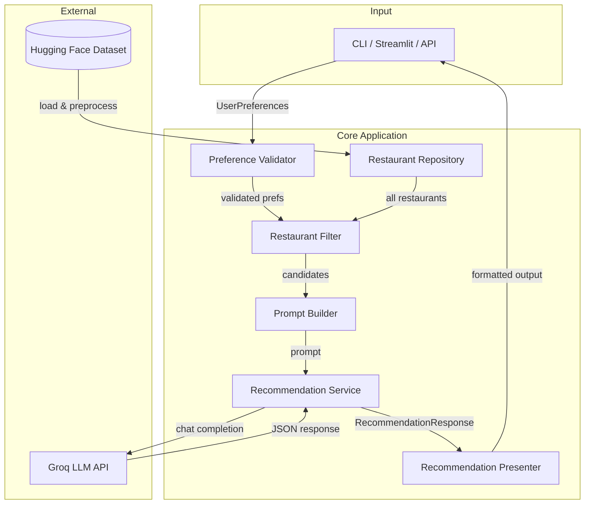
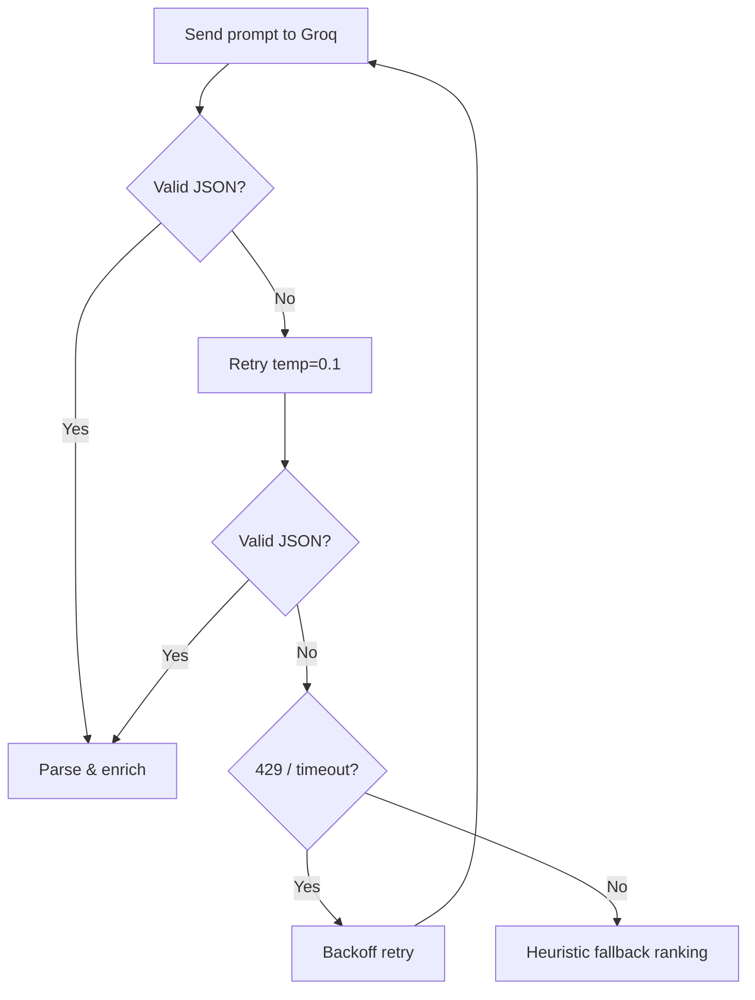
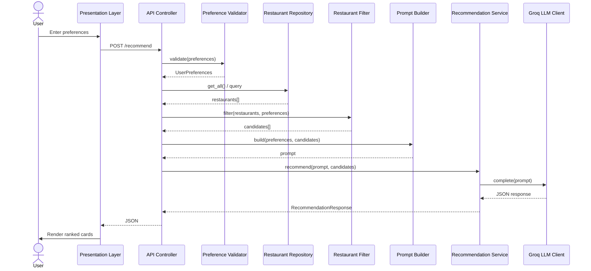
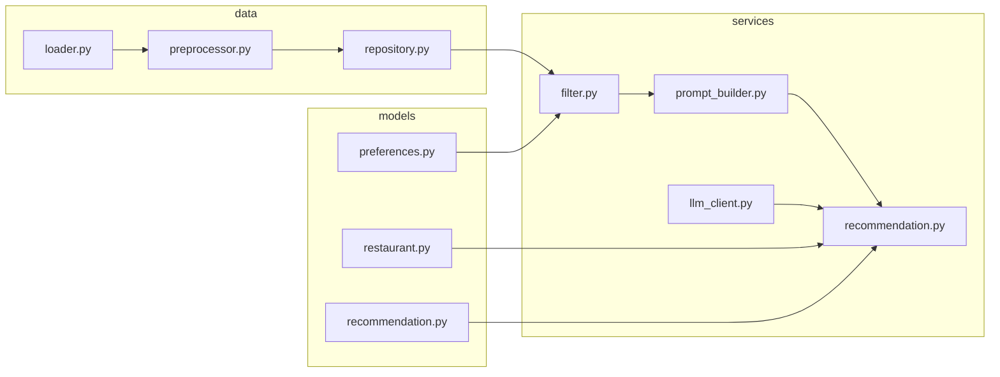
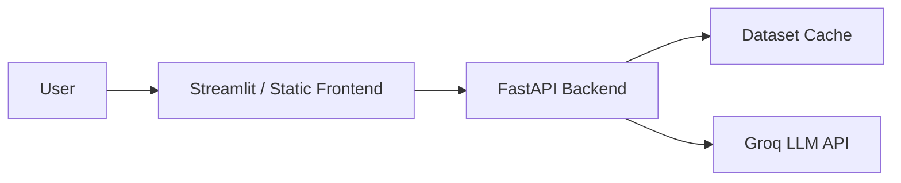

# Architecture — AI-Powered Restaurant Recommendation System

This document describes the technical architecture for the Zomato-inspired restaurant recommendation service defined in [`context.md`](context.md). The system combines structured restaurant data from Hugging Face with **Groq** as the sole LLM provider to produce personalized, explainable recommendations.

> **LLM decision:** This project uses **Groq** exclusively for all LLM workloads (ranking, explanations, summaries). No OpenAI, Anthropic, or local model backends are part of this architecture.

---

## Table of Contents

1. [Architecture Goals](#1-architecture-goals)
   - [1.1 LLM Provider — Groq](#11-llm-provider--groq)
2. [High-Level System Diagram](#2-high-level-system-diagram)
3. [Component Architecture](#3-component-architecture)
4. [Request Flow](#4-request-flow)
5. [Module Structure](#5-module-structure)
6. [Technology Stack](#6-technology-stack)
7. [API Design](#7-api-design)
8. [Data Flow Summary](#8-data-flow-summary)
9. [Cross-Cutting Concerns](#9-cross-cutting-concerns)
10. [Deployment Topology](#10-deployment-topology)
11. [Testing Strategy](#11-testing-strategy)
12. [Implementation Phases](#12-implementation-phases)
13. [Architecture Decisions](#13-architecture-decisions)
14. [Related Documents](#14-related-documents)

---

## 1. Architecture Goals

| Goal | Description |
|------|-------------|
| **Separation of concerns** | Data loading, filtering, Groq-powered reasoning, and presentation are isolated modules with clear interfaces. |
| **Deterministic pre-filtering** | Hard constraints (location, budget, rating) are applied before Groq to reduce token cost and hallucination risk. |
| **Explainability** | Every recommendation includes a Groq-generated rationale tied to user preferences. |
| **Extensibility** | Swap UI frameworks or data sources without rewriting core logic; Groq access is isolated behind `LLMClient`. |
| **Testability** | Pure functions for filtering/ranking prep; mockable Groq adapter (`LLMClient`) for unit tests. |

### 1.1 LLM Provider — Groq

All natural-language reasoning in this project runs on **Groq** — a hosted inference platform optimized for low-latency execution of open-weight models. Groq is the **only** LLM provider; the architecture does not include OpenAI, Anthropic, Azure OpenAI, or on-device models.

| Aspect | Choice |
|--------|--------|
| Provider | [Groq](https://console.groq.com) |
| Python SDK | [`groq`](https://github.com/groq/groq-python) (`pip install groq`) |
| Primary model | `llama-3.3-70b-versatile` |
| Fallback model | `llama-3.1-8b-instant` (dev / cost-sensitive runs) |
| API surface | Chat completions (`client.chat.completions.create`) |
| Auth | `GROQ_API_KEY` environment variable |

#### What Groq Does in This System

| Task | Groq responsibility |
|------|---------------------|
| Final ranking | Re-order pre-filtered candidates (top K) |
| Explanations | Per-restaurant rationale tied to user preferences |
| Summary | Optional overview of the recommendation set |

#### What Groq Does Not Do

- Dataset loading or preprocessing
- Hard filtering (location, budget, rating, cuisine)
- Inventing restaurants outside the candidate list

#### Configuration

| Setting | Env variable | Default |
|---------|--------------|---------|
| API key | `GROQ_API_KEY` | — (required) |
| Model | `GROQ_MODEL` | `llama-3.3-70b-versatile` |
| Fallback model | `GROQ_FALLBACK_MODEL` | `llama-3.1-8b-instant` |
| Temperature | `GROQ_TEMPERATURE` | `0.3` |

#### Integration Pattern

Groq access is isolated behind `LLMClient` in `src/services/llm_client.py`. No other module calls the Groq SDK directly. This adapter is the single swap point if a different provider were needed in a future milestone.

```python
from groq import Groq

client = Groq(api_key=settings.GROQ_API_KEY)
response = client.chat.completions.create(
    model=settings.GROQ_MODEL,
    messages=[
        {"role": "system", "content": system_prompt},
        {"role": "user", "content": user_prompt},
    ],
    temperature=settings.GROQ_TEMPERATURE,
    response_format={"type": "json_object"},  # when supported by model
)
```

#### Groq Operational Notes

- **Latency:** Groq inference is low-latency — suitable for interactive Streamlit/CLI feedback.
- **JSON output:** Enforce structured JSON in the prompt; use `response_format={"type": "json_object"}` when the selected model supports it.
- **Rate limits (429):** Retry with exponential backoff; fall back to heuristic ranking if retries exhaust.
- **Observability:** Log `response.usage` (token counts) and per-request latency; never log `GROQ_API_KEY`.

See also: [§3.4 Recommendation Engine (Groq)](3-component-architecture) and [§3.5 Groq Client Details](3-component-architecture).

---

## 2. High-Level System Diagram



---

## 3. Component Architecture

### 3.1 Data Ingestion Layer

**Responsibility:** Load, normalize, and cache the Zomato dataset once at startup (or on first request).

| Component | Role |
|-----------|------|
| `DatasetLoader` | Fetches `ManikaSaini/zomato-restaurant-recommendation` via `datasets` (Hugging Face). |
| `DataPreprocessor` | Maps raw columns to a canonical schema, handles nulls, normalizes text fields. |
| `RestaurantRepository` | In-memory query interface over the preprocessed dataset. |

#### Canonical Restaurant Schema

```python
Restaurant = {
    "id": str,              # stable identifier (index or dataset id)
    "name": str,
    "location": str,        # city / locality
    "cuisines": list[str],  # e.g. ["Italian", "Continental"]
    "cost_for_two": int,    # numeric cost indicator (INR)
    "rating": float,        # e.g. 4.2
    "votes": int,           # optional: popularity signal
    "rest_type": str,       # optional: casual dining, cafe, etc.
}
```

#### Preprocessing Steps

1. Download dataset split (typically `train`).
2. Select and rename relevant columns to the canonical schema.
3. Parse cuisine strings into lists (e.g. `"Italian, Chinese"` → `["Italian", "Chinese"]`).
4. Coerce `rating` and `cost` to numeric types; drop or impute invalid rows.
5. Normalize location strings (trim, title-case, alias map for city names).
6. Derive `budget_tier` from `cost_for_two` using configurable thresholds:

| Tier | Typical `cost_for_two` range (INR) |
|------|-------------------------------------|
| low | ≤ 500 |
| medium | 501 – 1500 |
| high | > 1500 |

Thresholds should be tuned after inspecting the actual dataset distribution.

#### Caching Strategy

- Load once into a pandas `DataFrame` or list of `Restaurant` objects.
- Persist a local parquet/CSV snapshot to avoid repeated Hugging Face downloads during development.
- Cache path: `./data/` (gitignored).

---

### 3.2 User Input Layer

**Responsibility:** Collect, validate, and normalize user preferences.

#### Input Model

```python
UserPreferences = {
    "location": str,           # required
    "budget": str,             # "low" | "medium" | "high"
    "cuisine": str | None,     # optional primary cuisine
    "min_rating": float,       # e.g. 3.5
    "additional": str | None,  # free-text: "family-friendly, quick service"
}
```

| Component | Role |
|-----------|------|
| `PreferenceForm` | UI form or CLI prompt collecting fields. |
| `PreferenceValidator` | Enforces required fields, enum values, rating bounds. |
| `PreferenceNormalizer` | Lowercases cuisine, maps city aliases, trims free text. |

#### Validation Rules

| Field | Rule |
|-------|------|
| `location` | Non-empty; must match at least one value in the dataset (or suggest closest matches). |
| `budget` | One of `low`, `medium`, `high`. |
| `min_rating` | Float in `[0.0, 5.0]`. |
| `cuisine` | Optional; fuzzy match against known cuisine vocabulary extracted from dataset. |
| `additional` | Optional free text passed through to Groq for soft matching. |

---

### 3.3 Integration Layer

**Responsibility:** Apply hard filters, rank candidates heuristically, and assemble the Groq prompt.

This layer sits between structured data and Groq. It ensures the model only reasons over a bounded, relevant candidate set.

#### 3.3.1 Restaurant Filter

Applies deterministic filters in sequence:

```
all restaurants
  → filter by location (exact or case-insensitive match)
  → filter by budget tier
  → filter by min_rating
  → filter by cuisine (if provided; match if cuisine in restaurant.cuisines)
  → sort by rating desc, then votes desc
  → take top N candidates (default N = 15–20)
```

| Component | Role |
|-----------|------|
| `RestaurantFilter` | Executes filter pipeline; returns `list[Restaurant]`. |
| `CandidateSelector` | Caps result count and applies tie-breaking. |

**Constraint relaxation:** If zero candidates remain, relax constraints in order: cuisine → budget → min_rating, and surface a warning to the user.

#### 3.3.2 Prompt Builder

Constructs a structured prompt containing:

1. **System instructions** — role, output format (JSON), ranking criteria.
2. **User preferences** — serialized `UserPreferences`.
3. **Candidate restaurants** — compact JSON array of filtered restaurants.
4. **Task** — rank top K (e.g. 5), explain each pick, optionally summarize.

**Design principles:**

- Require JSON output from Groq for reliable parsing.
- Include restaurant `id` in candidates so explanations map back to structured data.
- Instruct the model to only recommend from the provided list (no fabrication).
- Pass `additional` preferences as soft signals Groq may use in ranking/explanation.

**Example prompt structure (conceptual):**

```
[System]
You are a restaurant recommendation assistant for Indian cities.
Rank restaurants from the CANDIDATES list only. Return valid JSON.

[User Preferences]
{ location, budget, cuisine, min_rating, additional }

[Candidates]
[ { id, name, location, cuisines, cost_for_two, rating }, ... ]

[Task]
Return top 5 restaurants as JSON:
{
  "summary": "...",
  "recommendations": [
    { "id": "...", "rank": 1, "explanation": "..." }
  ]
}
```

---

### 3.4 Recommendation Engine (Groq)

**Responsibility:** Invoke **Groq** for ranking and explanations, handle retries, parse and validate the response, merge with structured data.

This layer is the only place Groq is called. All chat completions go through `LLMClient` → Groq API (`llama-3.3-70b-versatile` by default).

| Component | Role |
|-----------|------|
| `LLMClient` | Thin adapter over the **Groq** chat completions API via the official `groq` Python SDK. |
| `RecommendationService` | Orchestrates prompt → Groq → parse → enrich. |
| `ResponseParser` | Parses Groq JSON output; validates schema; handles malformed responses. |
| `RecommendationEnricher` | Joins Groq ranks/explanations with full restaurant records. |

#### Output Model

```python
Recommendation = {
    "rank": int,
    "name": str,
    "cuisine": str,           # joined cuisine string for display
    "rating": float,
    "estimated_cost": int,     # cost_for_two
    "explanation": str,       # Groq-generated
}

RecommendationResponse = {
    "summary": str | None,
    "recommendations": list[Recommendation],
    "metadata": {
        "candidates_considered": int,
        "filters_applied": dict,
        "model": str,
    }
}
```

#### Reliability Patterns

| Pattern | Purpose |
|---------|---------|
| Structured output / JSON mode | Reduce parse failures. |
| Retry with temperature reduction | Recover from invalid JSON. |
| Fallback ranking | If Groq fails, return heuristic top-K by rating with a generic explanation. |
| Idempotency | Same preferences + same dataset snapshot → reproducible candidate set. |

#### Groq Is Not Used For

- Loading data
- Hard filtering by location/budget/rating
- Inventing restaurants not in the candidate list

---

### 3.5 Groq Client Details

Implementation reference for `LLMClient` (`src/services/llm_client.py`). Provider overview and rationale: [§1.1 LLM Provider — Groq](#11-llm-provider--groq).

| Setting | Default | Notes |
|---------|---------|-------|
| Provider | Groq | Sole LLM provider for this project |
| SDK | `groq` | Official Python client (`pip install groq`) |
| API key | `GROQ_API_KEY` | Required; set in `.env`, never committed |
| Model | `llama-3.3-70b-versatile` | Primary model for ranking and explanations |
| Fallback model | `llama-3.1-8b-instant` | Faster/cheaper alternative for development |
| Temperature | `0.3` | Retry with `0.1` on JSON parse failure |

#### Retry & Fallback Flow



#### Groq Error Handling

| Groq response | Action |
|---------------|--------|
| Valid JSON | Parse and enrich recommendations |
| Malformed JSON | Retry once at lower temperature |
| HTTP 429 (rate limit) | Exponential backoff, then retry |
| Timeout / exhausted retries | Heuristic top-K ranking; note AI explanation unavailable |

---

### 3.6 Output Display Layer

**Responsibility:** Render recommendations in a clear, scannable format.

| Component | Role |
|-----------|------|
| `RecommendationPresenter` | Formats `RecommendationResponse` for UI or CLI. |
| `ResultsView` | Cards/table showing name, cuisine, rating, cost, explanation. |
| `SummaryBanner` | Optional Groq-generated summary at the top. |

#### Display Requirements

Each result card/row must show:

1. Restaurant Name
2. Cuisine
3. Rating
4. Estimated Cost
5. AI-generated explanation

#### UX Considerations

- Show applied filters (location, budget, etc.) above results.
- Display "no results" state with suggestions to broaden filters.
- Show loading state while dataset loads / Groq responds.
- Rank badge (1, 2, 3…) for quick scanning.

---

## 4. Request Flow

### Sequence Diagram



---

## 5. Module Structure

Recommended layout for a Python implementation:

```
zomato-milestone1/
├── docs/
│   ├── context.md
│   ├── architecture.md
│   ├── implementation-plan.md
│   ├── edge-case.md
│   └── problemStatement.txt
├── src/
│   ├── __init__.py
│   ├── main.py              # entry point (CLI or app bootstrap)
│   ├── config.py            # env vars, budget thresholds, top-K
│   ├── models/
│   │   ├── restaurant.py    # Restaurant dataclass
│   │   ├── preferences.py     # UserPreferences dataclass
│   │   └── recommendation.py# Recommendation, RecommendationResponse
│   ├── data/
│   │   ├── loader.py          # Hugging Face dataset loader
│   │   ├── preprocessor.py    # normalization & schema mapping
│   │   └── repository.py      # in-memory query interface
│   ├── services/
│   │   ├── filter.py          # RestaurantFilter
│   │   ├── prompt_builder.py  # PromptBuilder
│   │   ├── llm_client.py      # Groq LLM adapter (sole LLM entry point)
│   │   └── recommendation.py  # RecommendationService orchestrator
│   ├── api/
│   │   ├── routes.py          # FastAPI routes (optional)
│   │   └── schemas.py         # request/response Pydantic models
│   └── ui/
│       ├── cli.py             # terminal interface
│       └── streamlit_app.py   # or Gradio web UI (optional)
├── tests/
│   ├── test_filter.py
│   ├── test_preprocessor.py
│   └── test_recommendation.py
├── data/                      # cached parquet/csv (gitignored)
├── .env.example               # GROQ_API_KEY and model config
├── requirements.txt
└── README.md
```

### Module Dependency Graph



---

## 6. Technology Stack

| Layer | Technology | Rationale |
|-------|------------|-----------|
| Language | Python 3.11+ | Strong ecosystem for data + LLM integration. |
| Dataset | `datasets` (Hugging Face) | Direct access to the specified dataset. |
| Data processing | pandas | Filtering, normalization, caching. |
| **LLM provider** | **Groq** | **Sole LLM for this project** — ranking, explanations, summaries. |
| LLM model | `llama-3.3-70b-versatile` | Primary Groq model; strong reasoning for ranking + explanations. |
| LLM fallback model | `llama-3.1-8b-instant` | Optional Groq model for dev / faster iteration. |
| LLM SDK | `groq` | Official Groq Python client for chat completions. |
| API (optional) | FastAPI | Lightweight async REST for frontend decoupling. |
| UI (optional) | Streamlit or Gradio | Rapid prototyping of preference form + results. |
| Config | pydantic-settings + `.env` | Typed config and secret management. |
| Testing | pytest | Unit tests for filter, parser, preprocessor. |

---

## 7. API Design

Optional REST layer for frontend decoupling.

### `POST /api/v1/recommend`

**Request:**

```json
{
  "location": "Bangalore",
  "budget": "medium",
  "cuisine": "Italian",
  "min_rating": 4.0,
  "additional": "family-friendly, outdoor seating"
}
```

**Response:**

```json
{
  "summary": "Based on your preference for Italian cuisine in Bangalore with a medium budget...",
  "recommendations": [
    {
      "rank": 1,
      "name": "Example Ristorante",
      "cuisine": "Italian, Continental",
      "rating": 4.5,
      "estimated_cost": 1200,
      "explanation": "Highly rated Italian spot within your budget, known for family-friendly ambiance."
    }
  ],
  "metadata": {
    "candidates_considered": 18,
    "filters_applied": {
      "location": "Bangalore",
      "budget": "medium",
      "min_rating": 4.0,
      "cuisine": "Italian"
    },
    "model": "llama-3.3-70b-versatile"
  }
}
```

### `GET /api/v1/health`

Returns service status and whether the dataset is loaded.

### `GET /api/v1/locations`

Returns distinct locations from the dataset (populates UI dropdowns).

### `GET /api/v1/cuisines`

Returns distinct cuisines extracted from the dataset.

---

## 8. Data Flow Summary

```
Hugging Face Dataset
        │
        ▼
[Load & Preprocess] ──► RestaurantRepository (cached)
        │
User Preferences ──► [Validate] ──► [Filter candidates]
        │
        ▼
[Build Groq Prompt]
        │
        ▼
[Groq: Rank + Explain]
        │
        ▼
[Parse & Enrich]
        │
        ▼
RecommendationResponse ──► UI
```

---

## 9. Cross-Cutting Concerns

### 9.1 Configuration

Centralize in `config.py`:

| Variable | Description |
|----------|-------------|
| `HF_DATASET_NAME` | Hugging Face dataset identifier |
| `BUDGET_THRESHOLDS` | low/medium/high INR boundaries |
| `MAX_CANDIDATES_FOR_LLM` | Cap before prompt assembly (default 15–20) |
| `TOP_K_RECOMMENDATIONS` | Final recommendations returned (default 5) |
| `GROQ_MODEL` | Groq model ID; default: `llama-3.3-70b-versatile` |
| `GROQ_FALLBACK_MODEL` | Groq fallback; default: `llama-3.1-8b-instant` |
| `GROQ_API_KEY` | Groq API key from environment |
| `GROQ_TEMPERATURE` | Groq sampling temperature; default: `0.3` |
| `DATA_CACHE_PATH` | Local cache directory |

### 9.2 Error Handling

| Scenario | Behavior |
|----------|----------|
| Dataset download fails | Retry with backoff; show clear error in UI. |
| No restaurants match filters | Relax constraints or prompt user to adjust input. |
| Groq returns invalid JSON | Retry once at lower temperature; fallback to heuristic ranking. |
| Groq timeout / 429 rate limit | Retry with backoff; then return heuristic top-K with note that AI explanation is unavailable. |
| Missing `GROQ_API_KEY` | Fail fast with setup instructions pointing to Groq console. |
| Unknown location | Suggest valid locations from dataset. |

### 9.3 Logging & Observability

- Log filter counts (input size → candidate size).
- Log Groq latency and token usage (`response.usage`).
- Do not log full prompts containing API keys.
- Optional: trace ID per recommendation request.

### 9.4 Security

- Store API keys in environment variables, never in source control.
- Validate and sanitize all user inputs.
- Rate-limit API endpoints if deployed publicly.

---

## 10. Deployment Topology

### Development (Local)

```
Developer Machine
├── Python app (Streamlit / FastAPI + CLI)
├── Cached dataset in ./data/
└── Groq LLM API (cloud)
```

### Minimal Production



- Pre-load dataset at container startup.
- Single stateless API instance is sufficient for milestone scope.
- Scale horizontally later by sharing a read-only dataset snapshot.

---

## 11. Testing Strategy

| Test Type | Scope | Example |
|-----------|-------|---------|
| Unit | `RestaurantFilter` | Location + budget + rating filters return expected subset. |
| Unit | `Preprocessor` | Cuisine string parsing, numeric coercion. |
| Unit | `ResponseParser` | Valid/invalid Groq JSON handling. |
| Integration | `RecommendationService` | Mock Groq client returns fixed JSON; verify enriched output. |
| Snapshot | `PromptBuilder` | Prompt contains all candidates and preference fields. |

Use a frozen subset of the dataset (10–20 rows) in test fixtures for deterministic tests.

---

## 12. Implementation Phases

| Phase | Deliverable |
|-------|-------------|
| **Phase 0** | Project scaffolding, docs, config, environment setup |
| **Phase 1 — Data** | Load Hugging Face dataset, preprocess, cache, expose repository |
| **Phase 2 — Filter** | Implement preference validation and deterministic filtering |
| **Phase 3 — Groq LLM** | Prompt builder, Groq `LLMClient`, response parser, enricher |
| **Phase 4 — UI** | CLI or Streamlit form + results display |
| **Phase 5 — Hardening** | Error handling, fallback ranking, tests, README |

---

## 13. Architecture Decisions

| Decision | Choice | Alternatives Considered |
|----------|--------|---------------------------|
| LLM provider | **Groq only** (`llama-3.3-70b-versatile`) | OpenAI, Anthropic, Azure OpenAI, local models — **not used** |
| Groq SDK | **`groq` Python client** | Direct HTTP, other SDKs |
| Pre-filter before Groq | **Yes** — hard filters in code | Let Groq filter entire dataset (expensive, unreliable) |
| Groq output format | **Structured JSON** | Free-form text (harder to parse) |
| Data storage | **In-memory DataFrame** | Database (unnecessary for read-only milestone dataset) |
| Ranking split | **Heuristic shortlist + Groq final rank** | Pure Groq or pure heuristic |
| UI approach | **Streamlit for speed** | React SPA (more effort for milestone 1) |

---

## 14. Related Documents

| Document | Purpose |
|----------|---------|
| [`problemStatement.txt`](problemStatement.txt) | Original problem statement |
| [`context.md`](context.md) | Product requirements and workflow |
| [`implementation-plan.md`](implementation-plan.md) | Phase-wise implementation plan |
| [`edge-case.md`](edge-case.md) | Corner scenarios (living document) |
