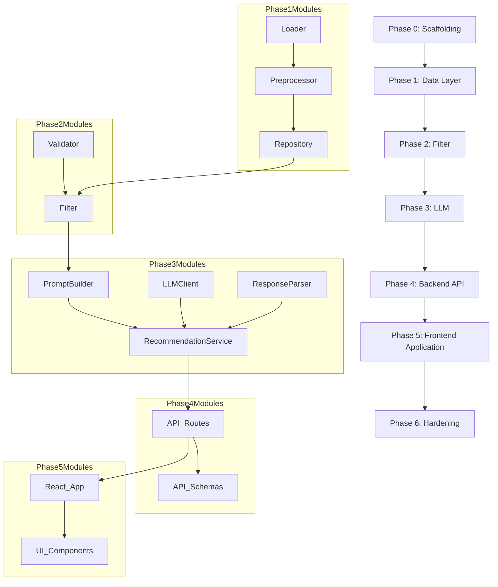

# Implementation Plan — AI-Powered Restaurant Recommendation System

This document is the phase-wise implementation plan for the Zomato-inspired restaurant recommendation service. It is derived from [`context.md`](context.md) and [`architecture.md`](architecture.md).

---

## Table of Contents

1. [Overview](#1-overview)
2. [Prerequisites](#2-prerequisites)
3. [Phase 0 — Project Scaffolding](#phase-0--project-scaffolding)
4. [Phase 1 — Data Layer](#phase-1--data-layer)
5. [Phase 2 — Filter & Validation](#phase-2--filter--validation)
6. [Phase 3 — LLM Integration](#phase-3--llm-integration)
7. [Phase 4 — Backend API](#phase-4--backend-api)
8. [Phase 5 — Frontend Application](#phase-5--frontend-application)
9. [Phase 6 — Hardening & Delivery](#phase-6--hardening--delivery)
10. [Dependency Graph](#dependency-graph)
11. [Definition of Done](#definition-of-done)
12. [Related Documents](#related-documents)

---

## 1. Overview

### Goal

Build an end-to-end application that accepts user preferences, filters restaurants from a real Zomato dataset, ranks candidates with Groq (`llama-3.3-70b-versatile`), and displays explainable recommendations.

### Phase Summary

| Phase | Name | Primary Deliverable | Est. Effort |
|-------|------|---------------------|-------------|
| 0 | Scaffolding | Repo structure, config, docs, dependencies | 1–2 hours |
| 1 | Data | Dataset load, preprocess, cache, repository | 2–4 hours |
| 2 | Filter | Validation, deterministic filtering, constraint relaxation | 2–3 hours |
| 3 | LLM | Prompt builder, Groq client, parser, enricher, orchestrator | 3–5 hours |
| 4 | Backend API | FastAPI endpoints, CORS, request/response schemas | 1–2 hours |
| 5 | Frontend App | High-quality web UI using Vite + React with rich aesthetics | 3–5 hours |
| 6 | Hardening | Tests, fallbacks, logging, README, edge cases | 3–5 hours |

### Implementation Order

Phases must be completed sequentially. Within each phase, tasks are ordered by dependency.

```
Phase 0 → Phase 1 → Phase 2 → Phase 3 → Phase 4 → Phase 5 → Phase 6
```

---

## 2. Prerequisites

Before starting Phase 0, ensure:

- [ ] Python 3.11+ installed
- [ ] Node.js & npm installed (for Vite + React frontend)
- [ ] Git repository initialized (optional but recommended)
- [ ] Groq API key obtained from https://console.groq.com
- [ ] Internet access for Hugging Face dataset download
- [ ] Cursor / IDE with Markdown preview for docs

---

## Phase 0 — Project Scaffolding

**Objective:** Establish project structure, configuration, documentation, and a runnable empty shell.

### Tasks

| # | Task | File(s) | Details |
|---|------|---------|---------|
| 0.1 | Create directory structure | `src/`, `tests/`, `data/`, `docs/` | Match layout in `architecture.md` §5 |
| 0.2 | Add `requirements.txt` | `requirements.txt` | `datasets`, `pandas`, `groq`, `pydantic`, `pydantic-settings`, `python-dotenv`, `pytest`, `fastapi`, `uvicorn` |
| 0.3 | Create `.env.example` | `.env.example` | `GROQ_API_KEY`, `GROQ_MODEL`, `GROQ_TEMPERATURE`, `HF_DATASET_NAME`, `DATA_CACHE_PATH` |
| 0.4 | Add `.gitignore` | `.gitignore` | Ignore `.env`, `data/`, `__pycache__/`, `.pytest_cache/`, `*.pyc`, `node_modules/` |
| 0.5 | Implement `config.py` | `src/config.py` | `pydantic-settings` `Settings` class with all env vars and budget thresholds |
| 0.6 | Create model stubs | `src/models/*.py` | Empty dataclasses: `Restaurant`, `UserPreferences`, `Recommendation`, `RecommendationResponse` |
| 0.7 | Create `main.py` entry point | `src/main.py` | Bootstrap that loads config and prints ready message |
| 0.8 | Finalize documentation | `docs/*.md` | `problemStatement.txt`, `context.md`, `architecture.md`, `implementation-plan.md`, `edge-case.md` |
| 0.9 | Add minimal `README.md` | `README.md` | Project overview, setup steps, link to docs |

### `config.py` Defaults

```python
HF_DATASET_NAME = "ManikaSaini/zomato-restaurant-recommendation"
BUDGET_THRESHOLDS = {"low": 500, "medium": 1500}  # high = above medium
MAX_CANDIDATES_FOR_LLM = 20
TOP_K_RECOMMENDATIONS = 5
GROQ_MODEL = "llama-3.3-70b-versatile"
GROQ_FALLBACK_MODEL = "llama-3.1-8b-instant"
GROQ_TEMPERATURE = 0.3
DATA_CACHE_PATH = "./data/restaurants.parquet"
```

### Acceptance Criteria

- [ ] `pip install -r requirements.txt` succeeds
- [ ] `python -m src.main` (or equivalent) runs without error
- [ ] `.env.example` documents all required variables
- [ ] All `docs/` files present and cross-linked (including `edge-case.md`)
- [ ] `data/` directory exists and is gitignored

### Verification

```bash
# Python config check
python -c "from src.config import settings; print(settings.GROQ_MODEL)"

# Test discovery (Phase 0 smoke tests should appear)
pytest --collect-only
```

---

## Phase 1 — Data Layer

**Objective:** Load the Hugging Face dataset, normalize to canonical schema, cache locally, and expose an in-memory repository.

### Tasks

| # | Task | File(s) | Details |
|---|------|---------|---------|
| 1.1 | Implement `DatasetLoader` | `src/data/loader.py` | `load_dataset(HF_DATASET_NAME)`, retry on network failure |
| 1.2 | Inspect raw columns | — | Log column names; map to canonical schema |
| 1.3 | Implement `DataPreprocessor` | `src/data/preprocessor.py` | Column rename, cuisine parsing, numeric coercion, location normalization |
| 1.4 | Derive `budget_tier` | `src/data/preprocessor.py` | Use `BUDGET_THRESHOLDS` from config |
| 1.5 | Handle invalid rows | `src/data/preprocessor.py` | Drop or impute rows with missing rating/cost; log counts |
| 1.6 | Cache to parquet/CSV | `src/data/loader.py` | Write to `DATA_CACHE_PATH`; load from cache if file exists |
| 1.7 | Implement `RestaurantRepository` | `src/data/repository.py` | `get_all()`, `get_locations()`, `get_cuisines()`, `get_by_id(id)` |
| 1.8 | Wire repository at startup | `src/main.py` | Load dataset once; expose singleton or factory |
| 1.9 | Unit tests for preprocessor | `tests/test_preprocessor.py` | Cuisine split, rating coercion, budget tier assignment |

### Acceptance Criteria

- [ ] Dataset downloads (or loads from cache) without manual steps
- [ ] `RestaurantRepository.get_all()` returns list of valid `Restaurant` objects
- [ ] `get_locations()` returns distinct, normalized city names
- [ ] `get_cuisines()` returns flat list of unique cuisine strings
- [ ] Cached file created at `DATA_CACHE_PATH` after first run
- [ ] `tests/test_preprocessor.py` passes

### Verification

```bash
python -c "
from src.data.repository import RestaurantRepository
repo = RestaurantRepository()
print(len(repo.get_all()), repo.get_locations()[:5])
"
pytest tests/test_preprocessor.py -v
```

---

## Phase 2 — Filter & Validation

**Objective:** Validate user input, normalize preferences, and deterministically filter restaurants before LLM invocation.

### Tasks

| # | Task | File(s) | Details |
|---|------|---------|---------|
| 2.1 | Finalize `UserPreferences` model | `src/models/preferences.py` | Pydantic model with validators for budget enum and rating range |
| 2.2 | Implement `PreferenceValidator` | `src/services/validator.py` | Required fields, location exists in dataset, cuisine fuzzy match |
| 2.3 | Implement `PreferenceNormalizer` | `src/services/validator.py` | Trim, lowercase cuisine, city alias map |
| 2.4 | Implement `RestaurantFilter` | `src/services/filter.py` | Pipeline: location → budget → min_rating → cuisine |
| 2.5 | Implement sorting & cap | `src/services/filter.py` | Sort by `rating` desc, `votes` desc; take `MAX_CANDIDATES_FOR_LLM` |
| 2.6 | Implement constraint relaxation | `src/services/filter.py` | If zero results: drop cuisine → widen budget → lower min_rating; attach warning flag |
| 2.7 | Unit tests for filter | `tests/test_filter.py` | Use frozen fixture (10–20 rows) in `tests/fixtures/` |
| 2.8 | Integration smoke test | `tests/test_filter.py` | Full pipeline with mock preferences against fixture data |

### Filter Pipeline

```
all restaurants
  → filter by location
  → filter by budget tier
  → filter by min_rating
  → filter by cuisine (optional)
  → sort (rating, votes)
  → take top N
```

### Acceptance Criteria

- [ ] Invalid budget or rating raises clear validation error
- [ ] Unknown location returns suggestions from `get_locations()`
- [ ] Filter returns only restaurants matching all hard constraints
- [ ] Empty result triggers relaxation with documented warning
- [ ] Filter logic is pure (no LLM, no side effects)
- [ ] `tests/test_filter.py` passes

### Verification

```bash
pytest tests/test_filter.py -v
```

---

## Phase 3 — LLM Integration

**Objective:** Build prompt assembly, Groq client, response parsing, enrichment, and the recommendation orchestrator.

### Tasks

| # | Task | File(s) | Details |
|---|------|---------|---------|
| 3.1 | Implement `PromptBuilder` | `src/services/prompt_builder.py` | System + user prefs + candidates JSON + task instructions |
| 3.2 | Implement `LLMClient` | `src/services/llm_client.py` | Groq `chat.completions.create`; read `GROQ_API_KEY` from settings |
| 3.3 | Add retry logic | `src/services/llm_client.py` | Retry on 429 with exponential backoff; retry on parse failure with `temperature=0.1` |
| 3.4 | Implement `ResponseParser` | `src/services/response_parser.py` | Parse JSON; validate `summary`, `recommendations[]` with `id`, `rank`, `explanation` |
| 3.5 | Implement `RecommendationEnricher` | `src/services/recommendation.py` | Join LLM output with `Restaurant` records by `id` |
| 3.6 | Implement `RecommendationService` | `src/services/recommendation.py` | Orchestrate: filter → prompt → LLM → parse → enrich → `RecommendationResponse` |
| 3.7 | Implement heuristic fallback | `src/services/recommendation.py` | On LLM failure: top-K by rating with generic explanation string |
| 3.8 | Unit tests for parser | `tests/test_recommendation.py` | Valid/invalid JSON fixtures |
| 3.9 | Integration test with mock LLM | `tests/test_recommendation.py` | Mock `LLMClient.complete()` returning fixed JSON |

### Acceptance Criteria

- [ ] `PromptBuilder` includes all preference fields and candidate `id`s
- [ ] `LLMClient` successfully calls Groq with real API key (manual smoke test)
- [ ] Parser rejects malformed JSON and triggers retry/fallback
- [ ] Enricher maps every recommendation to a real restaurant (no orphan ids)
- [ ] `RecommendationService.recommend()` returns complete `RecommendationResponse`
- [ ] Fallback path works when Groq is unavailable or returns bad JSON
- [ ] Tests pass without requiring live API (mocked LLM)

### Verification

```bash
pytest tests/test_recommendation.py -v
```

---

## Phase 4 — Backend API

**Objective:** Provide a robust FastAPI backend layer exposing endpoints for the frontend to consume.

### Tasks

| # | Task | File(s) | Details |
|---|------|---------|---------|
| 4.1 | Implement FastAPI backend routes | `src/api/routes.py`, `src/api/schemas.py` | `POST /api/v1/recommend`, `GET /health`, `GET /locations`, `GET /cuisines` |
| 4.2 | Enable CORS for web UI | `src/api/routes.py` | Allow `localhost` origins so the frontend app can call the API securely |
| 4.3 | Populate location & cuisine lists | `src/api/routes.py` | Expose `/locations` and `/cuisines` for dynamic dropdowns |
| 4.4 | Configure Startup events | `src/api/routes.py` | Ensure data layer and services are instantiated when the app starts |
| 4.5 | Write API tests | `tests/test_api.py` | Use `fastapi.testclient` to verify all routes return expected HTTP codes |

### Acceptance Criteria

- [ ] `GET /health` returns 200 OK
- [ ] `GET /locations` and `/cuisines` return lists of valid dataset items
- [ ] `POST /api/v1/recommend` accepts `UserPreferences` and returns top 5 recommendations
- [ ] Backend is isolated and does not serve static HTML (UI handles that independently)
- [ ] `python -m pytest tests/test_api.py -v` passes

### Verification

```bash
# Start the backend API (Phase 4)
py -m uvicorn src.api.routes:app --reload

# In another terminal, test health endpoint
curl http://localhost:8000/health
```

---

## Phase 5 — Frontend Application

**Objective:** Provide a premium, rich, and highly interactive user interface using Vite and React.

### Tasks

| # | Task | File(s) | Details |
|---|------|---------|---------|
| 5.1 | Scaffold Vite React App | `frontend/` | Initialize Vite with React & JavaScript/TypeScript |
| 5.2 | Establish Aesthetic Foundation | `frontend/src/index.css` | Apply Vanilla CSS with a rich dark-mode theme, glassmorphism, modern typography |
| 5.3 | Build API Client layer | `frontend/src/api.js` | Fetch wrappers for `/locations`, `/cuisines`, and `/api/v1/recommend` |
| 5.4 | Preference Form Component | `frontend/src/components/` | Inputs for location, budget, cuisine, and rating with dynamic datalists |
| 5.5 | Recommendations Display | `frontend/src/components/` | Premium result cards showing rank, name, cuisine, rating, cost, and AI explanation |
| 5.6 | UI Polish & Animations | `frontend/src/` | Loading spinners, hover effects, error banners, and relaxation warning banners |

### Display Requirements (Per Result)

1. Restaurant name
2. Cuisine
3. Rating
4. Estimated cost
5. AI-generated explanation

### Acceptance Criteria

- [ ] Vite dev server runs successfully
- [ ] UI is distinctly premium (using curated palettes, smooth gradients, and interactive hover states)
- [ ] Form populates location and cuisine options from the backend API
- [ ] Submitting preferences correctly posts to the FastAPI server and displays results elegantly
- [ ] Loading states and error messages are gracefully handled

### Verification

```bash
cd frontend
npm install
npm run dev

# Open the local network URL displayed by Vite and test visually
```

---

## Phase 6 — Hardening & Delivery

**Objective:** Production-quality error handling, test coverage, logging, documentation, and edge-case coverage.

### Tasks

| # | Task | File(s) | Details |
|---|------|---------|---------|
| 6.1 | Structured logging | `src/` | Log filter counts, LLM latency, token usage; never log API keys |
| 6.2 | Dataset download retry | `src/data/loader.py` | Backoff on Hugging Face failures |
| 6.3 | Complete fallback paths | `src/services/recommendation.py` | Document when heuristic ranking is used |
| 6.4 | Expand `edge-case.md` | `docs/edge-case.md` | Document all corner scenarios and implemented behavior |
| 6.5 | Full test suite | `tests/` | Target: filter, preprocessor, parser, recommendation (mocked) |
| 6.6 | Complete `README.md` | `README.md` | Setup, env vars, run instructions, architecture link |
| 6.7 | Snapshot test for prompts | `tests/test_prompt_builder.py` | Prompt contains candidates and preferences |
| 6.8 | End-to-end manual test checklist | `docs/` or README | Scenarios from `edge-case.md` |

### Edge Cases to Verify

| Scenario | Expected Behavior |
|----------|---------------------|
| Dataset download fails | Retry + clear error |
| Zero filter matches | Relax constraints + warning |
| Invalid LLM JSON | Retry once → heuristic fallback |
| Groq 429 / timeout | Backoff → heuristic fallback |
| Unknown location | Suggest valid locations |
| Missing `GROQ_API_KEY` | Fail fast with setup instructions |
| Empty cuisine (optional) | Skip cuisine filter |
| LLM recommends invalid id | Parser/enricher drops or errors gracefully |

### Acceptance Criteria

- [ ] `pytest` full suite passes
- [ ] README allows a new developer to run the backend and frontend in under 10 minutes
- [ ] `edge-case.md` documents each scenario with actual behavior
- [ ] No secrets in git history or source files

### Verification

```bash
pytest -v
# Run edge-case manual checklist from README
```

---

## Dependency Graph



---

## Definition of Done

The milestone is complete when:

- [ ] System loads real data from Hugging Face (with local cache)
- [ ] Hard filters run deterministically before LLM
- [ ] Groq ranks and explains top 5 restaurants
- [ ] **Backend API** securely exposes required endpoints
- [ ] User enters preferences via **Vite + React frontend app** which elegantly communicates with the backend
- [ ] Web UI displays premium aesthetic cards with name, cuisine, rating, cost, and AI explanation
- [ ] Fallback works when LLM fails (heuristic ranking + user-facing note)
- [ ] Core tests pass (`pytest`)
- [ ] Documentation set is complete (`docs/` + README + `edge-case.md`)
- [ ] `.env` is not committed; `.env.example` is present

---

## Related Documents

| Document | Purpose |
|----------|---------|
| [`problemStatement.txt`](problemStatement.txt) | Original problem statement |
| [`context.md`](context.md) | Product requirements and workflow |
| [`architecture.md`](architecture.md) | Technical architecture and components |
| [`edge-case.md`](edge-case.md) | Corner scenarios (living document) |
